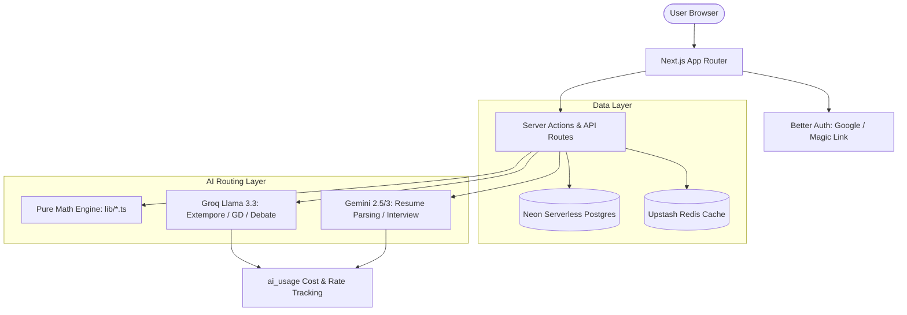

# PrepPulse

AI communication practice. Roll a topic you didn't see coming, talk for two
minutes, and get told exactly where you rambled, where you filled, and where you
actually landed it.

Interview prep is in here too — but it's deliberately the *second* thing you see,
not the pitch. Most people who want to get better at speaking aren't preparing
for an interview this week.

**Live:** [preppulse-one.vercel.app](https://preppulse-one.vercel.app)

---

## Status

| Phase | Scope | State |
| --- | --- | --- |
| 1 | Foundation — auth, schema, rate limiting, landing + dashboard | Done |
| 2 | Random Topic / Extempore + Daily Roll (Groq) | Done |
| 3 | Mock Interview (Gemini) + resume-driven recommendation | Done |
| 4 | Group Discussion + Debate (Groq) | Done |
| 5 | Progress, gamification & Redis | Done (Redis optional — falls back to Postgres) |
| 6 | Monetization scaffold | Done |
| 7 | Conversation & real-world scenario modes | Done |
| 8 | Admin & cost tracking | Done |
| 9 | Hinglish / Hindi language support | Done |
| 10 | Polish pass — Core Web Vitals, roleplay scoring, topic brief cache | Done |
| 11 | Portfolio polish — architecture diagrams, demo seed | Done |

---

## Architecture



---

## Stack

| Layer | Choice | Why |
| --- | --- | --- |
| Framework | Next.js 15 (App Router) + TypeScript | Server components keep the database off the client |
| Hosting | Vercel | Zero-config for Next, generous free tier |
| Database | Neon Postgres + Drizzle ORM | Serverless Postgres; Drizzle gives real SQL with real types |
| Auth | Better Auth | Google + magic link, no password storage to get wrong |
| Fast LLM | Groq | Scoring wants low latency more than depth |
| Deep LLM | Gemini | Resume parsing and long interview context (Phase 3) |
| Speech | Web Speech API | Free, on-device, no audio ever leaves the browser |

## Setup

```bash
npm install
cp .env .env.backup   # if you already have one
npm run db:migrate    # create tables in Neon
npm run db:seed       # load the 50 starter topics
npm run dev
```

Then open http://localhost:3000.

### Environment

All secrets live in a single git-ignored `.env`. Only `DATABASE_URL`,
`BETTER_AUTH_SECRET` and `GROQ_API_KEY` are needed to run Phases 1–2.

| Variable | Required | Source |
| --- | --- | --- |
| `DATABASE_URL` | yes | Neon → Connection string (pooled) |
| `BETTER_AUTH_SECRET` | yes | `openssl rand -base64 32` |
| `GROQ_API_KEY` | yes (Phase 2) | console.groq.com |
| `GEMINI_API_KEY` | Phase 3 | aistudio.google.com |
| `OPENROUTER_API_KEY` | no | openrouter.ai → Keys — a free-tier alternative judge model |
| `AI_PROVIDER` | no | `gemini` \| `groq` \| `openrouter` — overrides which one judges answers. Unset keeps each mode's own default (Groq for score/reading/discussion, Gemini for interviews). Resume PDF parsing always uses Gemini regardless. |
| `GOOGLE_CLIENT_ID` / `_SECRET` | no | Google Cloud Console — magic link works without it |
| `RESEND_API_KEY` | no | Without it, magic links print to the dev terminal |
| `RATE_LIMIT_PER_MINUTE` / `_PER_DAY` | no | Defaults 6 / 60 |
| `UPSTASH_REDIS_REST_URL` / `_TOKEN` | no | Switches the leaderboard to Redis; falls back to Postgres without it |
| `ADMIN_EMAILS` | no | Comma-separated allowlist for `/admin`. Empty = nobody. |

### Deploying

Set every variable above in Vercel → Settings → Environment Variables, with two
that **must differ from local**:

```
BETTER_AUTH_URL=https://preppulse-one.vercel.app
NEXT_PUBLIC_APP_URL=https://preppulse-one.vercel.app
```

Leaving these at `localhost:3000` is the single most common way a working local
build fails in production: OAuth callbacks and magic links point at the
developer's machine, and Better Auth's origin check rejects the real domain.

Google Cloud Console needs the production pair too — origin
`https://preppulse-one.vercel.app` and redirect
`https://preppulse-one.vercel.app/api/auth/callback/google`.

### Scripts

| Command | Does |
| --- | --- |
| `npm run dev` | Dev server (Turbopack) |
| `npm run dev:clean` | Deletes `.next` first — use after any `build` |
| `npm run build` | Production build (never while `dev` is running) |
| `npm run typecheck` | `tsc --noEmit` |
| `npm run test` | Seven pure-logic suites (no framework, plain asserts) |
| `npm run db:generate` | Generate SQL migration from the Drizzle schema |
| `npm run db:migrate` | Apply migrations to Neon |
| `npm run db:seed` | Load / refresh the topic pool (idempotent) |
| `npm run db:studio` | Drizzle Studio |

---

## How it's put together

```
src/
  app/
    page.tsx                  landing — fun modes first, interview prep second
    sign-in/                  Google + magic link
    dashboard/                streak, recent sessions, empty states
    practice/
      page.tsx                Daily Roll reveal
      actions.ts              server actions: start session, evaluate, abandon
      [sessionId]/            practice room + report
    api/auth/[...all]/        Better Auth handler
  db/
    auth-schema.ts            Better Auth tables (generated)
    app-schema.ts             topics, sessions, evaluations, profiles, usage, streaks
    topics.ts                 the 50 seed topics
  lib/
    scoring.ts                pure scoring maths — no I/O, unit-testable
    ai/score.ts               the Groq call
    rate-limit.ts             per-user caps
    errors.ts                 provider errors → human sentences
```

### Four decisions worth explaining

**The scoring engine doesn't trust the model with arithmetic.**
Six dimensions are scored, but only four of them come from Groq. Filler-word
control and speaking pace are *measured* in `lib/scoring.ts` — counted from the
transcript and the clock — because they're countable facts, and language models
are unreliable at counting. The overall score is then a weighted composite
computed in our code, never a number the model returned. Structure is weighted
highest for extempore (0.25); vocabulary lowest of the judged four (0.15),
because holding a shape under time pressure is the harder skill.

**Rate limiting reuses the cost-tracking table.**
Every LLM call already writes a row to `ai_usage` for Phase 8 cost reporting. The
limiter counts those rows per user over a rolling minute and day, so per-user
caps needed no new table and no new infrastructure — and unlike an in-process
counter, it survives across serverless invocations. Phase 5 swaps the counter for
Redis without touching a single call site.

**Raw provider errors never reach the UI.**
`lib/errors.ts` translates every 429 / 5xx / timeout into a sentence a person can
act on ("The AI service is at its free-tier limit right now. Your answer is
saved — try scoring it again in a minute."). A broken free tier should look like
a considered message, not a stack trace.

**An unmeasurable dimension is excluded, not scored zero.**
The practice room has a typing fallback for when the mic is blocked or the
browser has no Web Speech support. A typed answer has no speaking pace — timing
it against the wall clock produced a real bug in testing: a good answer scored
`pace 10/100` and lost 12 points off its composite purely for using the
accessibility fallback. Evaluations now record how the answer arrived, and
`weightedOverall` drops unmeasurable dimensions and renormalises over the rest.
The report shows `n/a` and says why. Regression covered in `scoring.test.ts`.

---

## Further reading

| Document | What's in it |
| --- | --- |
| [decisions.md](decisions.md) | Every meaningful decision, why it was taken, what was rejected, and how to reverse it |
| [flow.md](flow.md) | System design, data model, and sequence diagrams for each mode |
| [quiz.md](quiz.md) | Study questions for learning the codebase and defending it in an interview |
| [writeup-scoring-engine.md](writeup-scoring-engine.md) | Deep dive: how the weighted scoring engine avoids trusting raw LLM output |

## Notes

- `drizzle-kit` pulls a dev-only `esbuild` advisory through the deprecated
  `@esbuild-kit/*` packages. It affects `esbuild serve`, which drizzle-kit never
  runs, and it isn't part of the production bundle. Production dependencies audit
  clean.
- Audio is never written to disk or uploaded. Transcription happens in the
  browser via the Web Speech API; only the resulting text is stored.
