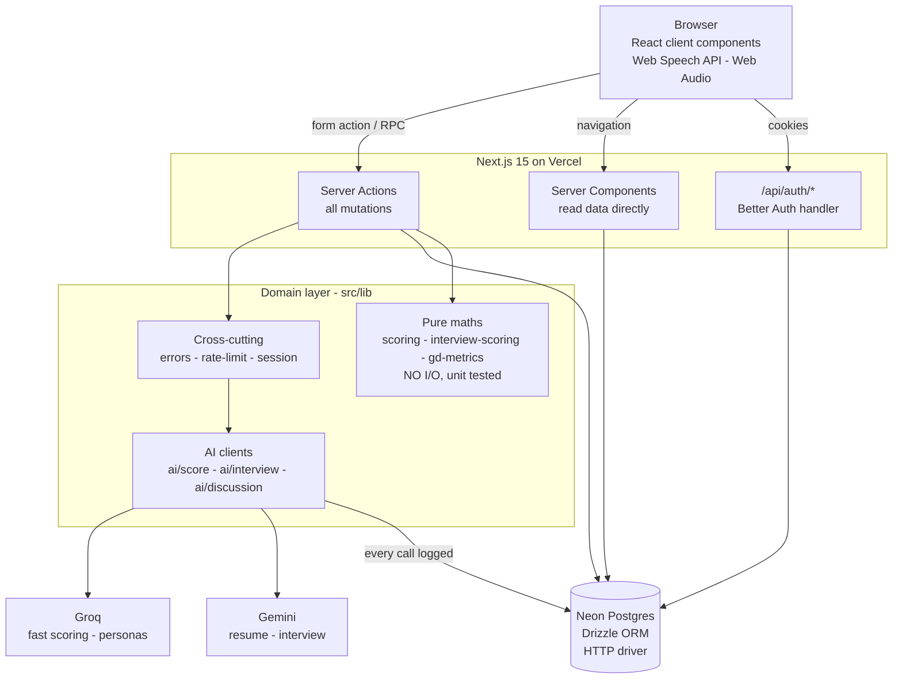
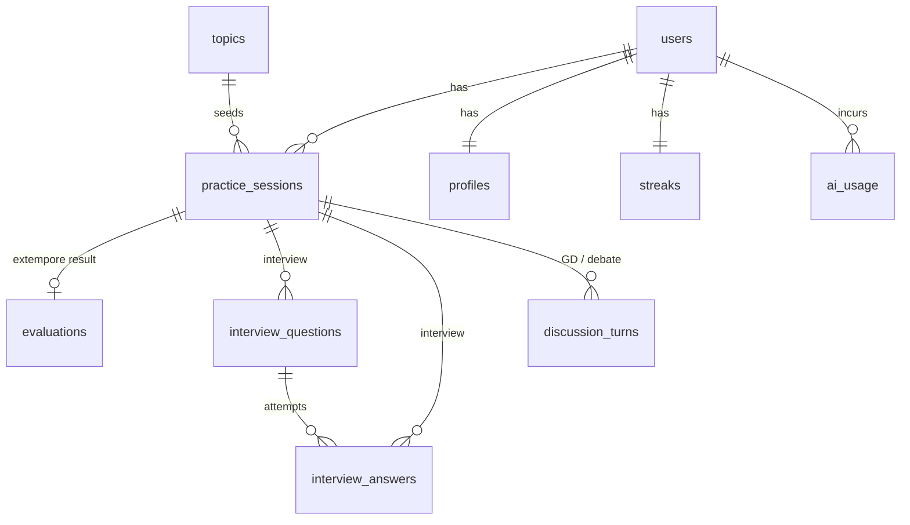
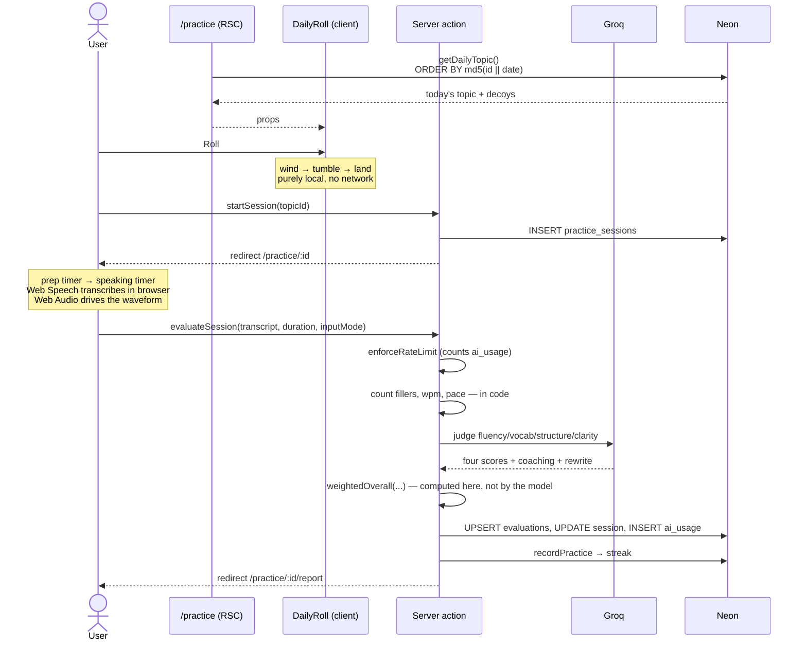
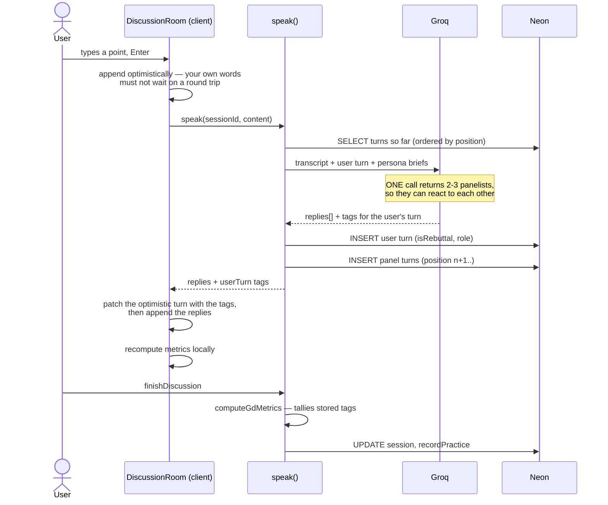

# PrepPulse — System Design & Flows

How the application is put together and how data moves through it.

---

## 1. Architecture at a glance



**The rule that shapes everything:** the browser never talks to the database or
to an LLM. Secrets stay server-side, and there is no REST layer for our own UI.

---

## 2. Layering

| Layer | Lives in | May import | Must not |
| --- | --- | --- | --- |
| Pages / components | `src/app`, `src/components` | lib, db types | Call providers directly |
| Server actions | `src/app/**/actions.ts` | lib, db | Be imported by other actions |
| Domain | `src/lib` | db, other lib | Import from `src/app` |
| Pure maths | `scoring.ts`, `interview-scoring.ts`, `gd-metrics.ts` | types only | **Any I/O whatsoever** |
| AI clients | `src/lib/ai` | lib, db | Be called from a client component |
| Data | `src/db` | — | Import from lib (except types) |

The pure-maths row is the one that matters. Those three files decide people's
scores, and keeping I/O out of them is what makes them testable with
`node:assert` and no framework.

---

## 3. Data model



`practice_sessions` is the spine. Every mode creates one; what hangs off it
depends on `mode`:

| mode | Result rows |
| --- | --- |
| `random_topic` | one `evaluations` row |
| `interview` | N `interview_questions`, M `interview_answers` (M ≥ N with retries) |
| `group_discussion`, `debate` | many `discussion_turns` |

`ai_usage` does double duty: Phase 8 cost reporting **and** the rate limiter's
counter (see `decisions.md` D7).

---

## 4. Flow: daily practice (Phase 2)



Audio never leaves the browser. Only the transcript text is sent.

---

## 5. Flow: mock interview (Phase 3)

The per-answer-then-aggregate loop — the most involved logic in the app.

```mermaid
sequenceDiagram
    actor U as User
    participant S as /interview (setup)
    participant A as Server action
    participant GM as Gemini
    participant D as Neon

    rect rgb(30,30,38)
    Note over U,D: Once, before question one
    U->>S: persona, role, question count
    S->>A: startInterview
    A->>D: read profile (resume JSON and/or written skills)
    A->>D: INSERT practice_sessions (config: persona, count, role)
    A->>GM: generate ALL N questions from this background
    GM-->>A: questions + rationale each
    A->>D: INSERT interview_questions (position 0..N-1)
    A-->>U: redirect /interview/:id
    end

    loop for each question
        U->>U: answer aloud (or typed)
        U->>A: submitAnswer(questionId, transcript)
        A->>A: enforceRateLimit
        A->>GM: score content/clarity/relevance/structure<br/>+ feedback + STAR ideal answer
        GM-->>A: verdict
        A->>A: weightedAnswerScore — computed here
        A->>D: INSERT interview_answers (attempt = n+1)
        A->>D: SELECT all answers for session
        A->>A: runningAverage — best attempt per question
        A-->>U: verdict + running average + delta vs first attempt
        alt Retry
            U->>A: submitAnswer again (attempt + 1)
            Note over A: the better attempt wins;<br/>the first is kept for the delta
        end
    end

    U->>A: finishInterview
    A->>A: aggregateScores — best attempt per question
    A->>D: UPDATE session completed, recordPractice
    A-->>U: redirect /interview/:id/report
```

**Why the question set is fixed upfront:** the session stays resumable, and the
interview cannot drift toward whatever the candidate happens to be good at.

**Why retries take the max:** averaging every attempt would make the Retry
button lower your score for using it.

---

## 6. Flow: group discussion (Phase 4)



Debate is the same machine with one opponent and four ordered stages —
opening, argument, rebuttal, closing.

---

## 7. Scoring pipeline

The rule, drawn once:

```mermaid
flowchart LR
    T["Transcript + clock"] --> C{"Countable<br/>or judgement?"}
    C -->|Countable| CODE["TypeScript<br/>fillers, wpm, pace,<br/>speaking share, turns"]
    C -->|Judgement| LLM["Model<br/>fluency, structure,<br/>relevance, clarity"]
    CODE --> W["weightedOverall()<br/>per-mode weights"]
    LLM --> W
    W --> OUT["Headline score"]

    style CODE fill:#1d3a2a
    style LLM fill:#3a2a1d
```



Unmeasurable dimensions are **dropped and renormalised**, never scored zero —
a typed answer has no speaking pace, and penalising the accessibility fallback
would be indefensible.

---

## 8. Cross-cutting concerns

**Every AI call, without exception:**

```
enforceRateLimit(userId)      count ai_usage rows in rolling windows
        │
    call provider             with a model fallback list
        │
recordUsage(...)              success or failure, always
        │
toAppError(...) on throw      raw provider error → human sentence
```

**Auth.** `getSession()` is React-`cache`d per request. It re-throws Next's
control-flow errors (`DYNAMIC_SERVER_USAGE`, `NEXT_REDIRECT`) rather than
swallowing them; anything else is treated as signed-out so a database blip does
not blank the page.

**Ownership.** Every session read is scoped by `userId` as well as `id`. A
session id alone is never sufficient.

---

## 9. Route map

| Route | Auth | Purpose |
| --- | --- | --- |
| `/` | public | Editorial landing; embeds the day's real topic |
| `/sign-in` | public | Google / password / email OTP |
| `/dashboard` | required | Today's topic as the dominant object |
| `/practice` | required | Daily Roll reveal |
| `/practice/[id]` | required | Timer, waveform, transcript |
| `/practice/[id]/report` | required | Coaching, then measurements |
| `/interview-prep` | required | Skills text and/or resume upload |
| `/interview` | required | Persona, role, question count |
| `/interview/[id]` | required | One question at a time, verdict each |
| `/interview/[id]/report` | required | Aggregate + question by question |
| `/discuss` | required | GD or debate setup |
| `/discuss/[id]` | required | Live room |
| `/api/auth/[...all]` | — | Better Auth |

---

## 10. Build & test

```bash
npm run dev        # single server on 3000 (autoPort false — two servers corrupt .next)
npm run typecheck  # tsc --noEmit
npm run lint
npm run test       # three pure-logic suites, node:assert, no framework
npm run build

npm run db:generate && npm run db:migrate
npm run db:seed    # idempotent
```

Tests cover the maths that decides someone's score: filler matching, pace and
density curves, weighted composites, retry rules, speaking-share bands and
debate stage order. Everything else is verified by driving the real app in a
browser against the real database.
