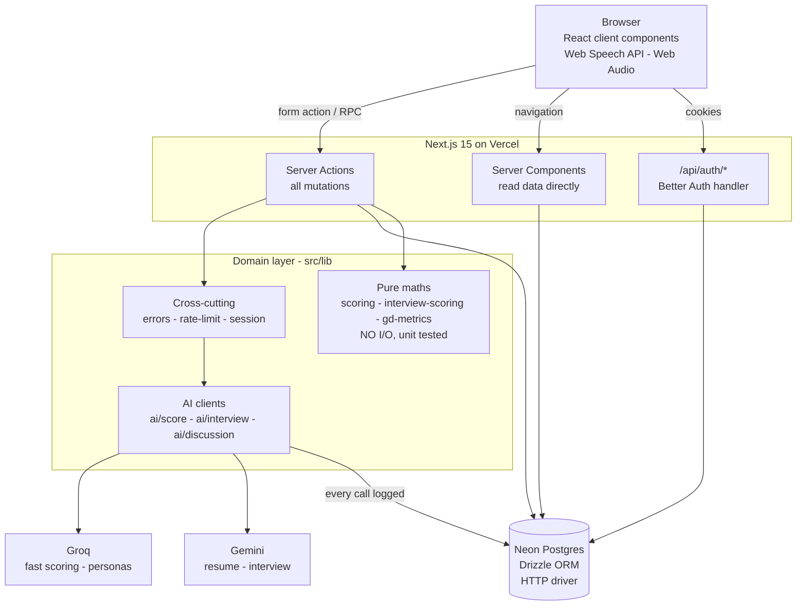
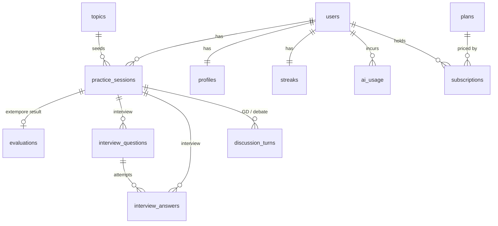
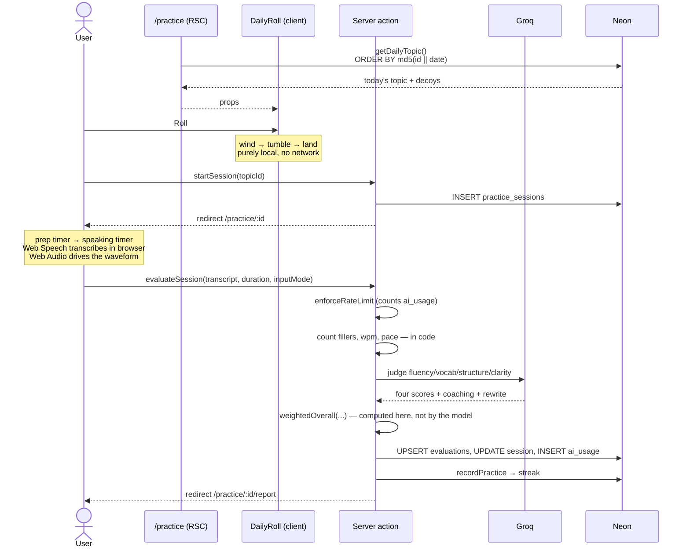
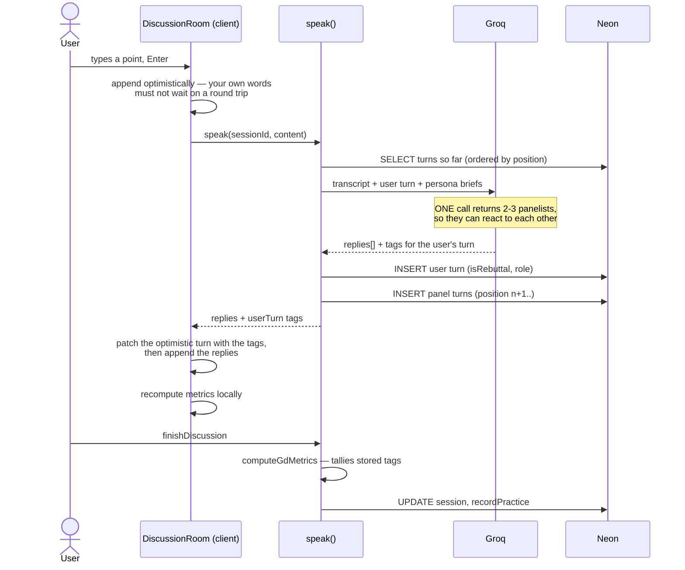
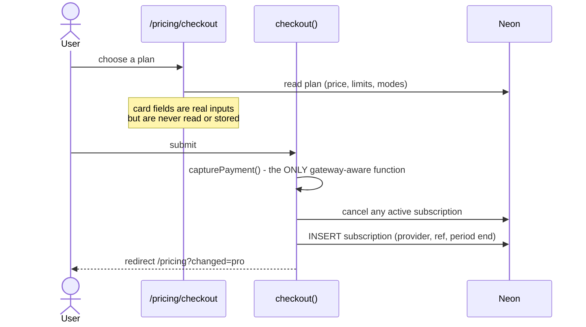

# PrepPulse — System Design & Flows

How the application is put together and how data moves through it.

---

## 1. Architecture at a glance



**The rule that shapes everything:** the browser never talks to the database or
to an LLM. Secrets stay server-side, and there is no REST layer for our own UI.

---

## 2. Layering

| Layer | Lives in | May import | Must not |
| --- | --- | --- | --- |
| Pages / components | `src/app`, `src/components` | lib, db types | Call providers directly |
| Server actions | `src/app/**/actions.ts` | lib, db | Be imported by other actions |
| Domain | `src/lib` | db, other lib | Import from `src/app` |
| Pure maths | `scoring.ts`, `interview-scoring.ts`, `gd-metrics.ts`, `gamification.ts`, `billing.ts`, `scenarios.ts`, `cost.ts` | types only | **Any I/O whatsoever** |
| AI clients | `src/lib/ai` | lib, db | Be called from a client component |
| Cache | `src/lib/redis.ts` | — | Ever throw — returns `null` on any failure |
| Data | `src/db` | — | Import from lib (except types) |

The pure-maths row is the one that matters. Those five files decide people's
scores and what they've paid for, and keeping I/O out of them is what makes
them testable with `node:assert` and no framework.

`plans` is read at request time, so prices are never compiled into the app.

---

## 3. Data model



`practice_sessions` is the spine. Every mode creates one; what hangs off it
depends on `mode`:

| mode | Result rows |
| --- | --- |
| `random_topic` | one `evaluations` row |
| `interview` | N `interview_questions`, M `interview_answers` (M ≥ N with retries) |
| `group_discussion`, `debate` | many `discussion_turns` |
| `conversation`, `scenario` | many `discussion_turns` — same table, same engine |

`ai_usage` does double duty: Phase 8 cost reporting **and** the rate limiter's
counter (see `decisions.md` D7).

---

## 4. Flow: daily practice (Phase 2)



Audio never leaves the browser. Only the transcript text is sent.

---

## 5. Flow: mock interview (Phase 3)

The per-answer-then-aggregate loop — the most involved logic in the app.

```mermaid
sequenceDiagram
    actor U as User
    participant S as /interview (setup)
    participant A as Server action
    participant GM as Gemini
    participant D as Neon

    rect rgb(30,30,38)
    Note over U,D: Once, before question one
    U->>S: persona, role, question count, focus technologies
    Note over S: chips come from the candidate's own<br/>resume skills + project tech, plus free entry
    S->>A: startInterview (focus[] as repeated form fields)
    A->>D: read profile (resume JSON and/or written skills)
    A->>D: INSERT practice_sessions (config: persona, count, role, focusAreas)
    A-->>U: redirect /interview/:id — does NOT wait for questions
    Note over U: PreparingRound renders; the wait is<br/>watched, not hidden behind a hung button
    U->>A: prepareQuestions(sessionId)
    A->>A: return early if questions already exist
    A->>A: focusedCount = max(len(focus), ceil(N * 0.6)) — computed here
    A->>GM: generate ALL N questions, >= focusedCount on the chosen topics<br/>each tagged with which topic it tests
    Note over GM: 503 "high demand" is retried 3x with backoff,<br/>then the next model id
    GM-->>A: questions + rationale + focusArea each
    A->>A: validate focusArea against the chosen list (invented tags dropped)
    A->>D: INSERT interview_questions (position 0..N-1, focus_area)
    A-->>U: router.refresh() — the room renders
    end

    loop for each question
        U->>U: answer aloud — pausing ends the turn, no button
        Note over U: 10-minute cap; warning from 9:00
        U->>A: submitAnswer(questionId, transcript)
        A->>A: enforceRateLimit; clamp duration + transcript to the cap
        A->>GM: score content/clarity/relevance/structure<br/>+ feedback + STAR ideal answer
        GM-->>A: verdict
        A->>A: weightedAnswerScore — computed here
        A->>D: INSERT interview_answers (attempt = n+1)
        A->>D: SELECT all answers for session
        A->>A: runningAverage — best attempt per question
        A-->>U: score + feedback + strengths/fixes<br/>(ideal answer withheld until the report)
        alt Retry
            U->>A: submitAnswer again (attempt + 1)
            Note over A: the better attempt wins;<br/>the first is kept for the delta
        end
    end

    U->>A: finishInterview
    A->>A: aggregateScores — best attempt per question
    A->>D: UPDATE session completed, recordPractice
    A-->>U: redirect /interview/:id/report
    Note over U: report shows every ideal answer,<br/>plus "Tested on: Postgres x2, Kubernetes x2"
```

**Why the question set is fixed upfront:** the session stays resumable, and the
interview cannot drift toward whatever the candidate happens to be good at.

**Why generation moved out of the form action:** it held a POST open for ten to
twenty seconds, and a 503 from Gemini threw from a server action — which Next
renders as a bare 500 page, discarding the setup the user had just filled in.
The session row is the cheap reliable part, so it lands first. Close the tab
mid-generation and the session is waiting on the dashboard.

**Why retries take the max:** averaging every attempt would make the Retry
button lower your score for using it.

**Why the focus tag is validated, not trusted:** "the questions will
concentrate on what you picked" is only a real promise if it can be counted.
The model declares a topic per question; code checks it against the list the
candidate actually chose and drops anything invented. Coverage is then a number
— shown as a chip on the question and summarised on the report.

**Why the ideal answer waits:** reading a perfect answer to question 3 and then
answering question 4 trains recall, not thinking. It is generated immediately
(same cost either way) and stored, but only surfaced at the end where comparing
it to what you said is the point.

**How a turn ends:** silence in the *transcript*, not silence on the
microphone. See §10.

---

## 6. Flow: group discussion (Phase 4)



Debate is the same machine with one opponent and four ordered stages —
opening, argument, rebuttal, closing.

---

## 6b. One engine, four modes (Phase 7)

Conversation and scenario role-plays reuse the discussion machinery wholesale.
The only thing that varies is who is on the other side and what they want.

```mermaid
flowchart TB
    subgraph Shared["Shared engine - built once in Phase 4"]
        T[("discussion_turns")]
        SP["speak() action"]
        UI["DiscussionRoom"]
    end

    GD["Group discussion<br/>4 personas + moderator"] --> SP
    DB["Debate<br/>1 opponent, 4 stages"] --> SP
    CV["Conversation<br/>1 counterpart, no agenda"] --> SP
    SC["Scenario<br/>1 counterpart, opposing goal"] --> SP

    SP --> T
    T --> UI

    SP -.->|"role-play only"| GUARD{"Deflection<br/>or repeat?"}
    GUARD -->|yes| RETRY["re-ask once,<br/>naming the failure"]
    GUARD -->|no| OK["append"]

    style Shared fill:#1d2a3a
    style GUARD fill:#3a2a1d
```



**What Phase 7 actually added:** one data file (`lib/scenarios.ts`), one prompt
function, one setup page and one start action. The room, transcript, composer,
optimistic append and metrics all came for free.

**The guard is the interesting part.** Deflecting is always the safe reply for
a model, so "tell me more about that" is the failure mode it falls into under
uncertainty. Telling it not to helps; *checking whether it did* is what holds
the line — the same reason filler words are counted rather than judged.

---

## 6c. Flow: admin & cost (Phase 8)

```mermaid
flowchart LR
    C1["Groq call"] --> U[("ai_usage<br/>one row per call")]
    C2["Gemini call"] --> U
    C3["Failed call"] --> U

    U --> RL["Rate limiter<br/>counts rows per window"]
    U --> AD["Admin page<br/>groups and sums"]

    AD --> P1["Cost per session<br/>← the number that matters"]
    AD --> P2["By provider / model / operation"]
    AD --> P3["Median latency, not mean"]

    style U fill:#1d3a2a
    style P1 fill:#2a1d3a
```



`ai_usage` was written in Phase 1 for exactly this, and the rate limiter reads
the same rows — one table doing two jobs.

Failed calls are logged too: a burst of provider 429s is usage worth backing
off from, and a failure rate is something the admin page should show.

---

## 7. Flow: entitlements and checkout (Phase 6)

Two enforcement points, on purpose.

```mermaid
flowchart TB
    P["Setup page<br/>(server component)"] -->|checkCanStart| G{"Entitled?"}
    G -->|no| PW["Render a paywall<br/>with the reason"]
    G -->|yes| BTN["Render the start button"]

    BTN --> A["Server action"]
    A -->|gateOrRedirect| G2{"Entitled?"}
    G2 -->|no| RD["redirect /pricing"]
    G2 -->|yes| GO["Create session"]

    style PW fill:#3a2a1d
    style RD fill:#3a2a1d
```



The page check is **honesty** — never offer a button that cannot work. The
action check is **security** — a server action can be called directly, so the
page check alone would be decorative.

Neither throws. Throwing from a form action renders Next's error boundary, so
the explanation never reaches the user.



Swapping in a real gateway changes `capturePayment()` and the checkout
component, plus a webhook. No schema migration: `subscriptions` already carries
`provider`, `provider_ref` and `current_period_end`.

---

## 8. Flow: leaderboard with fallback (Phase 5)

```mermaid
flowchart LR
    S["Session scored"] --> R{"Redis<br/>configured?"}
    R -->|yes| Z["ZADD lb:2026-w11<br/>keep the best score<br/>EXPIRE 9 days"]
    R -->|no| SKIP["skip - Postgres<br/>is already the record"]

    RD["Homepage / progress"] --> Q{"Redis hit?"}
    Q -->|yes| FAST["ZRANGE REV 0..9<br/>one O(log N) command"]
    Q -->|null: miss, timeout,<br/>or not configured| SLOW["Postgres:<br/>scan 7 days, join, group, sort"]

    style FAST fill:#1d3a2a
    style SLOW fill:#2a2a3a
```



Every Redis helper returns `null` on any failure, so an outage degrades to the
Postgres path rather than failing the page. Recording is best-effort and
wrapped in `.catch()`: the leaderboard is a nicety, and it must never fail a
request whose real work already succeeded.

Week buckets expire on their own, so there is no trimming job.

---

## 9. Scoring pipeline

The rule, drawn once:

```mermaid
flowchart LR
    T["Transcript + clock"] --> C{"Countable<br/>or judgement?"}
    C -->|Countable| CODE["TypeScript<br/>fillers, wpm, pace,<br/>speaking share, turns"]
    C -->|Judgement| LLM["Model<br/>fluency, structure,<br/>relevance, clarity"]
    CODE --> W["weightedOverall()<br/>per-mode weights"]
    LLM --> W
    W --> OUT["Headline score"]

    style CODE fill:#1d3a2a
    style LLM fill:#3a2a1d
```



Unmeasurable dimensions are **dropped and renormalised**, never scored zero —
a typed answer has no speaking pace, and penalising the accessibility fallback
would be indefensible.

---

## 10. Cross-cutting concerns

**Every AI call, without exception:**

```
enforceRateLimit(userId)      count ai_usage rows WHERE ok — see below
        │
    call provider             3 attempts per model, 0.8/1.6/3.2s backoff
        │                     on 429, 5xx, timeout, connection reset
        │                     404 → next model id; anything else → stop
        │
recordUsage(...)              success or failure, every attempt
        │
toAppError(...) on throw      raw provider error → human sentence
```

Retrying is not optional politeness: Gemini answers `503 "experiencing high
demand"` often enough that treating it as fatal took down the whole
start-interview flow. Failing fast on the rest matters equally — a wrong API key
would otherwise spend twelve calls learning what the first response said.

**The limiter counts successes, not attempts.** `ai_usage` gets one row per
provider attempt, so with retries and fallback a single answer can write up to
eighteen. Counting all of them meant one click during an outage blew a
six-per-minute cap by itself. A failed call returns no tokens and costs nothing,
so only `ok = true` rows consume the budget — exactly one per completed
operation, whichever provider served it.

**Cross-provider fallback.** When every Gemini model is exhausted, the call goes
to Groq rather than to the user as an error.

```
callGemini ──► gemini-3.6-flash ──► gemini-2.5-flash ──► gemini-flash-latest
                  (3 attempts each, backoff between)
                                   │ all exhausted
                                   ▼
                           tryGroqFallback
                                   │
              ┌────────────────────┼────────────────────┐
       parts contain          isContentError        otherwise
       inline_data (PDF)      (bad JSON, empty)         │
              │                     │                   ▼
          decline               decline            callGroq(...)
     (Groq is text-only)   (our bug — keep it       recorded under the
                            visible, don't          same operation name
                            double its cost)
```

Both refusals are deliberate. `extractResume` sends PDF bytes natively, which
Groq's chat API cannot accept, so resume extraction has no honest fallback. And
a provider that answered with malformed JSON is reporting a prompt or schema
bug, not an outage — failing over would hide it and pay twice.

`lib/ai/retry.ts` holds the policy both clients share; `lib/ai/groq.ts` is the
single Groq entry point, extracted from three duplicated copies in `score.ts`,
`discussion.ts` and `topic-brief.ts`.

**Auth.** `getSession()` is React-`cache`d per request. It re-throws Next's
control-flow errors (`DYNAMIC_SERVER_USAGE`, `NEXT_REDIRECT`) rather than
swallowing them; anything else is treated as signed-out so a database blip does
not blank the page.

**Ownership.** Every session read is scoped by `userId` as well as `id`. A
session id alone is never sufficient.

**Turn-taking.** `useVoiceSession` ends a turn when the *transcript* stops
growing, not when the microphone goes quiet.

```
recogniser emits a word ──► effect re-runs ──► clearTimeout, start a new one
                                                        │
                                 no new words for silenceMs
                                                        │
                                                 sendTurn(text)
```

Mic energy is still sampled, but only for the level meter and for barge-in
(talking over the AI reclaims the floor above `BARGE_IN_LEVEL`). Deciding
end-of-turn from energy fails in both directions: background noise means the
level never drops, so the turn never ends; a mid-sentence breath means it does,
so half an answer gets submitted. The recogniser already applies its own noise
handling, so reading its output is both simpler and more accurate.

`silenceMs` is 1.1s for discussion (the gap a person leaves before speaking) and
2.4s in the interview room, where thinking mid-answer is normal. `canAutoSend`
reports whether the hands-free path can work at all; only when it is false does
a manual submit appear.

---

## 11. Route map

| Route | Auth | Purpose |
| --- | --- | --- |
| `/` | public | Editorial landing; embeds the day's real topic |
| `/sign-in` | public | Google / password / email OTP |
| `/dashboard` | required | Today's topic as the dominant object |
| `/practice` | required | Daily Roll reveal |
| `/practice/[id]` | required | Timer, waveform, transcript |
| `/practice/[id]/report` | required | Coaching, then measurements |
| `/read` | required | Pick a tongue twister or passage |
| `/read/[id]` | required | Read aloud; words light up as they land, result in place |
| `/interview-prep` | required | Skills text and/or resume upload |
| `/interview` | required | Persona, role, question count, focus technologies |
| `/interview/[id]` | required | One question at a time, hands-free, score each |
| `/interview/[id]/report` | required | Aggregate, coverage, every ideal answer |
| `/discuss` | required | GD or debate setup (renders a paywall if locked) |
| `/discuss/[id]` | required | Live room |
| `/rooms` | required | Conversation & scenario role-plays |
| `/progress` | required | Chart, badges, standing |
| `/admin` | admin only | Cost and usage — 404s for everyone else |
| `/pricing` | public | Plans read from the database |
| `/pricing/checkout` | required | Dummy gateway |
| `/s/[slug]` | **public** | Opt-in share card — score only, no transcript |
| `/api/auth/[...all]` | — | Better Auth |
| `/sitemap.xml`, `/robots.txt` | public | Generated from `env.appUrl` |
| `/opengraph-image`, `/apple-icon`, `/icon.svg` | public | Generated from the shared logo geometry |

`/s/[slug]` is the only public authenticated-data route. It is reachable solely
via an unguessable opt-in slug and deliberately shows a partial record.

---

## 12. Build & test

```bash
npm run dev        # single server on 3000 (autoPort false — two servers corrupt .next)
npm run typecheck  # tsc --noEmit
npm run lint
npm run test       # five pure-logic suites, node:assert, no framework
npm run build      # NEVER while dev is running - both write .next

npm run db:generate && npm run db:migrate
npm run db:seed    # idempotent: topics and plans
```

Three scripts check the AI paths against the live providers, because their
failures are the ones unit tests cannot see:

```bash
npm run verify:resume     # builds a PDF by hand, checks nothing is invented
npm run verify:interview  # scores a long rambling answer 3x (the JSON bug)
npm run verify:focus      # proves picked technologies steer the question set
npm run verify:retry      # stubs 503/429/401 — transient retried, permanent not
```

Tests cover the maths that decides someone's score or what they've paid for:
filler matching, pace and density curves, weighted composites, retry rules,
speaking-share bands, debate stage order, badge thresholds, token caps, trend
excluding rest days, entitlements, and month-end rollover. Everything else is
verified by driving the real app in a browser against the real database.

**Optional environment.** `UPSTASH_REDIS_REST_URL` and
`UPSTASH_REDIS_REST_TOKEN` switch the leaderboard from Postgres to Redis with
no code change. Absent, everything still works.
